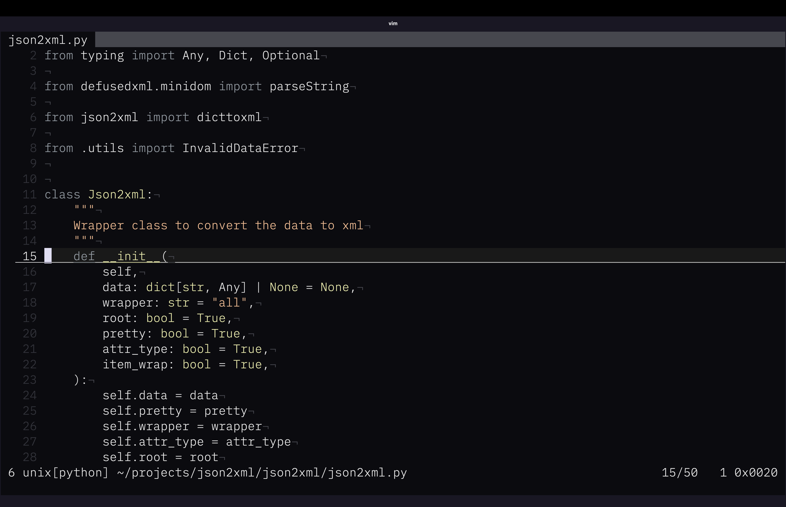
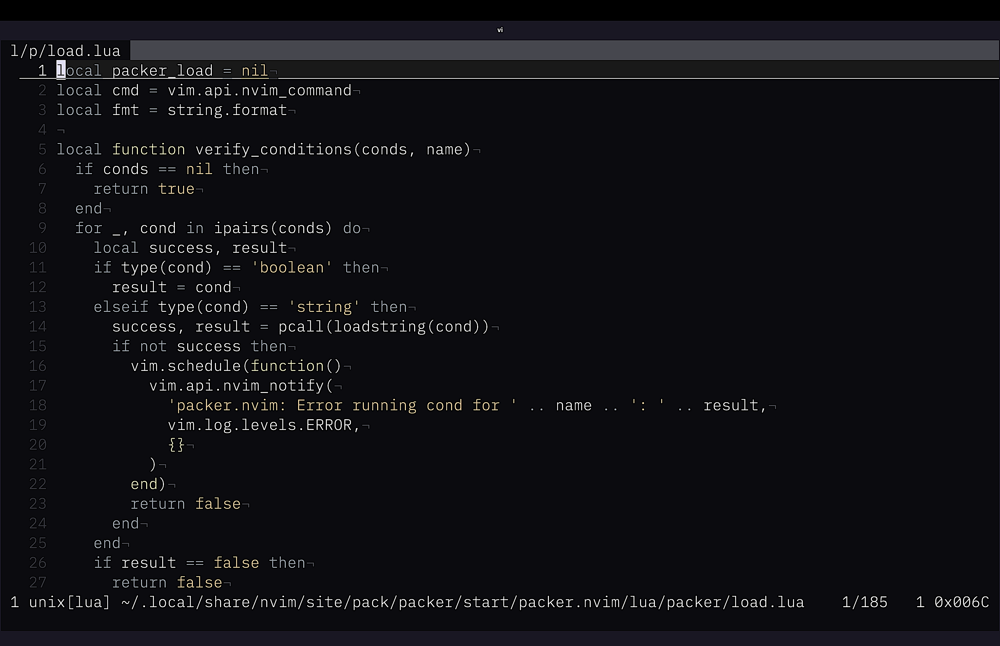
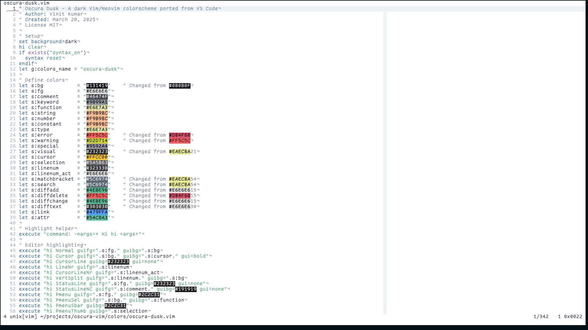
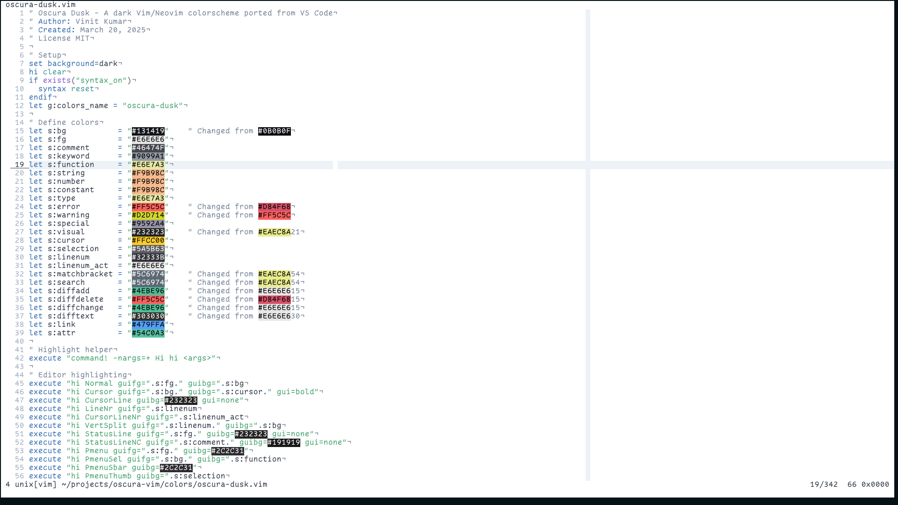

# Oscura Vim Colorscheme Collection

A comprehensive collection of colorschemes for Vim/Neovim based on the popular VSCode Oscura theme. This collection provides comfortable, eye-friendly themes that maintain excellent contrast and readability for both dark and light environments.

> **Based on:** [Oscura](https://marketplace.visualstudio.com/items?itemName=Fey.oscura) for VSCode by Fey. Please show your support by starring the [original repository](https://github.com/narative/oscura)!

## 🌟 Available Themes

### 🌙 Dark Themes

#### `oscura` - Classic Dark
The original dark theme, perfect for low-light environments and extended coding sessions. Features a balanced color palette with excellent contrast.

#### `oscura-dusk` - Dark Dusk
A warmer dark variant with dusk-inspired colors. Ideal for those who prefer warmer tones while maintaining the dark aesthetic.

### ☀️ Light Themes

#### `oscura-light` - Classic Light
A clean, modern light theme designed for bright environments. Provides excellent readability with a professional appearance.

#### `oscura-dusk-light` - Light Dusk
A warm light variant with dusk-inspired colors. Perfect for users who want the benefits of a light theme with warmer, more comfortable tones.

## 📸 Screenshots

### Dark Themes
| oscura (Dark) | oscura-dusk (Dark Dusk) |
|---------------|-------------------------|
|  |  |

### Light Themes
| oscura-light | oscura-dusk-light |
|--------------|-------------------|
|  |  |

## ✨ Features

- **4 Complete Themes**: 2 dark + 2 light variants
- **Optimized for Productivity**: Designed for long coding sessions
- **High Contrast**: Excellent readability in all lighting conditions
- **Comprehensive Syntax Highlighting**: Support for 50+ programming languages
- **Modern UI Support**: Status lines, line numbers, popup menus, and more
- **Git Integration**: Enhanced diff highlighting and merge conflict markers
- **Search & Visual Mode**: Clear highlighting for search results and selections
- **Plugin Compatibility**: Works with popular plugins like LSP, Treesitter, and more

## 🚀 Installation

### Method 1: Plugin Manager (Recommended)

#### Vim-Plug
Add to your `.vimrc`:
```vim
Plug 'vinitkumar/oscura-vim'
```

#### Packer.nvim
Add to your Neovim config:
```lua
use 'vinitkumar/oscura-vim'
```

#### Lazy.nvim
Add to your Neovim config:
```lua
{
  'vinitkumar/oscura-vim',
  lazy = false, -- Load during startup for immediate availability
}
```

#### Vundle
Add to your `.vimrc`:
```vim
Plugin 'vinitkumar/oscura-vim'
```

### Method 2: Manual Installation

1. **Clone or download** this repository
2. **Copy the theme files** to your colors directory:

```bash
# For Vim
mkdir -p ~/.vim/colors
cp colors/oscura*.vim ~/.vim/colors/

# For Neovim
mkdir -p ~/.config/nvim/colors
cp colors/oscura*.vim ~/.config/nvim/colors/
```

### Method 3: Download Individual Themes

If you only want specific themes, download them individually:

```bash
# Download specific themes
curl -o ~/.vim/colors/oscura.vim https://raw.githubusercontent.com/vinitkumar/oscura-vim/main/colors/oscura.vim
curl -o ~/.vim/colors/oscura-light.vim https://raw.githubusercontent.com/vinitkumar/oscura-vim/main/colors/oscura-light.vim
# ... and so on for other themes
```

## 🎨 Usage

### Basic Usage

Add one of these lines to your `.vimrc` or Neovim config:

```vim
" Dark themes
colorscheme oscura          " Classic dark
colorscheme oscura-dusk     " Dark dusk variant

" Light themes  
colorscheme oscura-light    " Classic light
colorscheme oscura-dusk-light " Light dusk variant
```

### Advanced Configuration

#### Auto-switching Based on Time
```vim
function! SetOscuraTheme()
  let hour = str2nr(strftime('%H'))
  if hour >= 6 && hour < 18
    " Daytime - use light theme
    colorscheme oscura-light
  else
    " Nighttime - use dark theme
    colorscheme oscura
  endif
endfunction

" Call on startup
call SetOscuraTheme()

" Optional: Auto-switch every hour
autocmd CursorHold * call SetOscuraTheme()
```

#### Neovim Lua Configuration
```lua
-- In your init.lua or colorscheme config
local function set_oscura_theme()
  local hour = tonumber(os.date('%H'))
  if hour >= 6 and hour < 18 then
    vim.cmd('colorscheme oscura-light')
  else
    vim.cmd('colorscheme oscura')
  end
end

-- Set theme on startup
set_oscura_theme()

-- Optional: Auto-switch every hour
vim.timer.start(3600000, set_oscura_theme, {repeat = true})
```

#### Terminal Integration
For better terminal integration, ensure your terminal supports true colors:

```vim
" Add to your .vimrc
set termguicolors
set background=dark  " or 'light' for light themes
colorscheme oscura

" For the dusk variant
colorscheme oscura-dusk
```

## 🔧 Requirements

- **Vim**: 7.4 or later
- **Neovim**: 0.5 or later
- **Terminal**: True color support (recommended)
- **GUI**: Any Vim GUI (GVim, MacVim, etc.)

### Checking True Color Support
```bash
# Test if your terminal supports true colors
curl -s https://raw.githubusercontent.com/termstandard/colors/master/256colors2.pl | perl
```

## 🎯 Plugin Compatibility

These themes work well with popular plugins:

- **LSP**: Language Server Protocol highlighting
- **Treesitter**: Advanced syntax highlighting
- **Git**: Fugitive, Gitsigns, etc.
- **Status Lines**: Lightline, Airline, Lualine
- **File Explorers**: NERDTree, Nvim-tree
- **Fuzzy Finders**: FZF, Telescope

## 🤝 Contributing

Contributions are welcome! Here's how you can help:

1. **Report Issues**: Found a bug or have a suggestion? Open an issue!
2. **Submit Pull Requests**: Improvements, new features, or bug fixes
3. **Share Screenshots**: Show off your setup with different themes
4. **Improve Documentation**: Help make the README even better

### Development Setup
```bash
git clone https://github.com/vinitkumar/oscura-vim.git
cd oscura-vim
# Make your changes
# Test with: vim -u NONE -c 'colorscheme oscura'
```

## 📄 License

MIT License - see [LICENSE](LICENSE) file for details.

## 🙏 Acknowledgments

- **Original Theme**: [Oscura](https://github.com/narative/oscura) by Fey
- **VSCode Extension**: [Oscura](https://marketplace.visualstudio.com/items?itemName=Fey.oscura)
- **Community**: All contributors and users who provide feedback

---

**⭐ If you like this colorscheme collection, please give it a star!**
